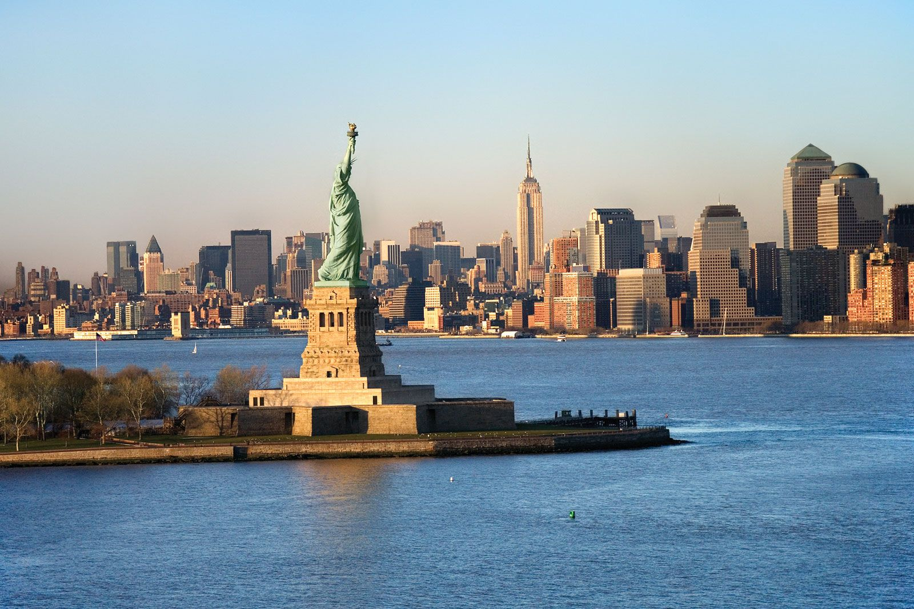

# AX-LLM


| Platform | Build Status |
| -------- | ------------ |
| AX650    | |

## Overview

**AX-LLM** is developed by **[Axera](https://www.axera-tech.com/)**. This project explores the feasibility and performance of large language models on Axera hardware and provides a basis for rapid evaluation and further development of LLM applications by the community.

### Supported chips

- AX650A/AX650N
  - SDK ≥ v1.45.0_P31

### Supported models

- InternVL2-1B
- SmolVLM-256M-Instruct

### Download links

- InternVL2-1B: Baidu Netdisk [download link](https://pan.baidu.com/s/1_LG-sPKnLS_LTWF3Cmcr7A?pwd=ph0e)
- SmolVLM-256M-Instruct: [Download](https://github.com/techshoww/ax-llm/releases/download/v1.0.0/SmolVLM-256M-Instruct-AX650.tar.gz). We recommend using the AXERA Huggingface distribution at [AXERA Huggingface](https://huggingface.co/AXERA-TECH/SmolVLM-256M-Instruct) which uses smaller prefill_len and runs faster.

## Building from source

-- Clone this repository
    ```shell
    git clone  https://github.com/AXERA-TECH/ax-llm.git
    cd ax-llm
    ```
-- Clone the `ax650n_bsp_sdk` repository
    ```shell
    git clone https://github.com/AXERA-TECH/ax650n_bsp_sdk
    ```
-- Carefully review `build.sh` and update the `BSP_MSP_DIR` variable (points to `ax650n_bsp_sdk`) before running `./build.sh`.
    ```shell
    ./build.sh
    ```
- After a successful build, the `build/install/bin` directory should contain the following files (prebuilt executables are available on Baidu Netdisk)
  ```
  $ tree install/bin/
    install/bin/
    ├── main
    ├── run_bf16.sh
    └── run_qwen_1.8B.sh
  ```
  
## Example: Running the model

### SmolVLM-256M-Instruct



#### 1) Start the HTTP Tokenizer server
```
cd scripts
python smolvlm_tokenizer_512.py  --host {your host} --port {your port}   # consistent with run_smolvlm.sh
```

#### 2) Run the model on the board
1) First update the HTTP host setting in `run_smolvlm.sh`.
2) Copy `scripts/run_smolvlm.sh`, `src/post_config.json`, `build/install/bin/main`, and `assets/demo.jpg` to your Axera board
3) Run `run_smolvlm.sh`  
```shell
root@ax650 ~/SmolVLM-256M-Instruct-Infer # bash run_smolvlm.sh 
[I][                            Init][ 106]: LLM init start
bos_id: 1, eos_id: 49279
  2% | █                                 |   1 /  34 [0.01s<0.27s, 125.00 count/s] tokenizer init ok[I][                            Init][  26]: LLaMaEmbedSelector use mmap
100% | ████████████████████████████████ |  34 /  34 [1.59s<1.59s, 21.40 count/s] init vpm axmodel ok,remain_cmm(3498 MB)B)
[I][                            Init][ 254]: max_token_len : 1023
[I][                            Init][ 259]: kv_cache_size : 192, kv_cache_num: 1023
[I][                            Init][ 267]: prefill_token_num : 128
[I][                            Init][ 269]: vpm_height : 512,vpm_width : 512
[I][                            Init][ 278]: LLM init ok
Type "q" to exit, Ctrl+c to stop current running
prompt >> Can you describe this image?
image >> assets/demo.jpg
[I][                          Encode][ 337]: image encode time : 119.578003 ms, size : 36864
[I][                             Run][ 548]: ttft: 57.75 ms
 The image depicts a large, historic statue of Liberty, located in New York City. The statue is a prominent landmark and is known for its iconic presence in the city. The statue is located on a pedestal that is surrounded by a large, circular base. The base of the statue is made of stone and is painted in a light blue color. The statue is surrounded by a large, circular ring that encircles the base.

The statue is made of bronze and is quite large, measuring approximately 100 feet in height. The statue is mounted on a pedestal that is made of stone and is painted in a light blue color. The pedestal is rectangular and is supported by a series of columns. The columns are made of stone and are painted in a light blue color. The statue is surrounded by a large, circular ring that encircles the base.

In the background, there is a large cityscape with a variety of buildings and structures. The sky is clear and blue, indicating that it is a sunny day. The buildings are tall and have a modern architectural style, with large windows and balconies. The buildings are mostly made of glass and steel, and they are painted in a variety of colors.

There are a few trees and bushes visible in the foreground, which are located on the left side of the image. The trees are green and appear to be healthy. There is also a small, white building visible in the background, which is likely a hotel or a small office.

The overall atmosphere of the image is one of peace and tranquility. The statue is a symbol of freedom and liberty, and the surrounding buildings and structures add to the sense of the city's historical and cultural significance.

In summary, the image depicts the Statue of Liberty, a large, historic statue located in New York City. The statue is a prominent landmark and is surrounded by a large, circular ring that encircles the base. The statue is painted in a light blue color and is mounted on a pedestal that is surrounded by a large, circular ring. The statue is surrounded by a large, circular ring that encircles the base. The background includes a large cityscape with tall buildings and a clear blue sky. The overall atmosphere of the image is one of peace and tranquility.

[N][                             Run][ 687]: hit eos,avg 76.88 token/s
```

## Inference speed
| Stage | Time |
|------|------|
| Image Encoder (512x512) | 120 ms  | 
| Prefill |  57ms    |
| Decode  |  77 token/s |

## Reference

- [InternVL2-1B](https://huggingface.co/OpenGVLab/InternVL2-1B)
- [SmolVLM-256M-Instruct](https://huggingface.co/HuggingFaceTB/SmolVLM-256M-Instruct)
## Discussion / Support

- GitHub issues
- QQ 群: 139953715
